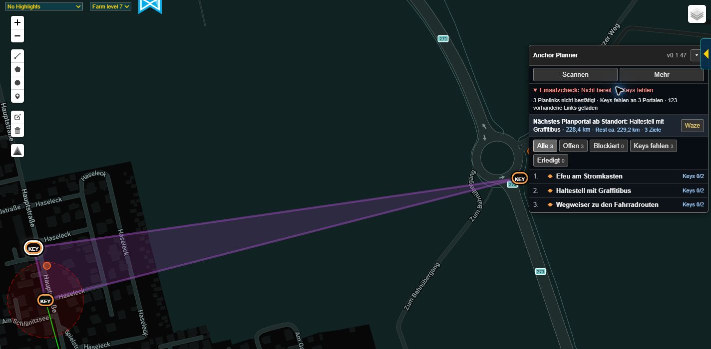
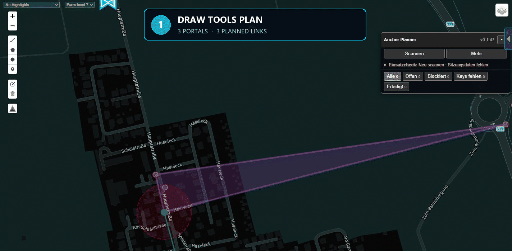

# IITC Anchor Planner

[English](README.md) | [Deutsch](README.de.md)

**Felder planen. Blocker finden. Keys zählen. Route abarbeiten.**

Anchor Planner macht aus Draw-Tools- und Auto-Draw-Linkplänen einen direkt nutzbaren IITC-Arbeitsablauf: Planportale, benötigte Keys, vorhandene Links, Blocker, Arbeitsziele und Navigation — gebündelt in einem kompakten Panel für Desktop und Mobil.

## In Aktion

*Den gesamten Plan auf einen Blick: beteiligte Portale, noch benötigte Keys und das nächste Arbeitsziel.*

*In wenigen Sekunden vom Draw-Tools-Plan zur einsatzbereiten Checkliste — scannen, Einsatzbereitschaft prüfen und den genauen Keybedarf jedes Portals einsehen.*

## Installation

**Aktuelle stabile Version:**

<https://raw.githubusercontent.com/emgeka/iitc-anchor-planner/main/releases/iitc-anchor-planner.user.js>

Die `.user.js`-Datei wird über einen Userscript-Manager oder die jeweilige IITC-Plugin-Installation eingebunden. Falls `.user.js`-Downloads in der eigenen Umgebung unpraktisch sind, enthält das GitHub-Release zusätzlich eine inhaltlich identische `.txt`-Fassung.

Aktuelle Veröffentlichung: **0.1.55**

<https://github.com/emgeka/iitc-anchor-planner/releases/tag/v0.1.55>

### Beta-Test: 0.2.0-beta.12

Dieser Featurestand zielt auf **0.2.0**. Größere neue Funktionen erhöhen die
Minor-Version; Patch-Releases bleiben Korrekturen und kleinen Anpassungen vorbehalten.

Das separate [Beta-Userscript](https://raw.githubusercontent.com/emgeka/iitc-anchor-planner/beta/beta-builds/iitc-anchor-planner-beta.user.js)
unterstützt **Details anzeigen** auf aktuellen und älteren IITC-Versionen.
IITC kann bei diesem ausdrücklichen Klick fehlende oder veraltete Details nachladen,
ohne die Karte zu bewegen. Fehlende Portaldetails ersetzen die vorherige
Seitenleistenanzeige durch eine Meldung.

Die Beta zeigt **Aufgaben** kompakt als Tabelle mit Position, Portal, Keys,
Links und Blockern. Zeilen aufklappen für Richtung, Abbauziel, Erledigung und
Navigation. Portalnamen öffnen IITC-Details; fehlende Keys und der nächste
Stopp werden hervorgehoben. Die Beta ergänzt ausdrückliche Wurfrichtungen je Planlink und gerichteten
Keybedarf. Blocker-Abbau wird vor den abhängigen Linkaufträgen eingeordnet;
Endportal und Position werden mit möglichst wenig zusätzlicher Luftlinie
gewählt. Gemeinsame Blocker erscheinen einmal; Arbeiten an demselben Portal
werden nach Möglichkeit gebündelt. Die automatische Route vergleicht jetzt
gesamte Strecken und überprüft Portalreihenfolge, gemeinsame Abbau-Endportale
und bereits eingefügte Blocker-Abstecher zusammen. Nur kürzere Varianten mit
erhaltenen Aufgaben und Abbau-vor-Wurf-Abhängigkeiten werden übernommen.

**Aufgaben → Route ab Standort** verwendet IITC User Location; **Gespeicherte
Reihenfolge** bewahrt die Portalreihenfolge und fügt nötige Abbau-Stopps ein.
Kleine GPS-Änderungen behalten den Vorschlag bei; Bewegungen über 100 m oder
geänderte Aufgaben können ihn neu berechnen. Manuelle Blocker-Meldungen bleiben
von Intel-Beobachtungen getrennt. Die Route ist ein Vorschlag; Eroberung,
ausgehende Linklimits und Bauen unter Feldern werden noch nicht validiert.
Planvorschau zeigt die verbleibende Aufgabenroute als Kartenvorschau.

Nur eine Anchor-Planner-Variante je IITC-Instanz installieren. Die Beta verwendet
Portal-Erledigung und Einstellungen weiter. Vorhandene Keys werden ausschließlich
aus dem IITC-Plugin Keys gelesen; alte lokale Bestände werden nicht übernommen; neue Richtungen
beginnen unbestätigt. Im Auswahlfeld ist ein gekennzeichneter Vorschlag vom
zuerst besuchten Planendportal zum anderen Endportal vorausgewählt.
**Vorschlag übernehmen** bestätigt ihn; bis dahin bleibt der Keybedarf an
beiden Endportalen eine Schätzung. Vor der Rückkehr zu Stable den Plan exportieren: Stable ignoriert
die neuen Richtungen und Blocker-Aufgabeneinstellungen und verwendet seine
bisherige Keyberechnung. Die Beta aktualisiert sich nur aus ihrer eigenen
Adresse; Stable bleibt 0.1.55. Der Key-Ablauf ist im echten IITC-Praxistest bestätigt; getrennte Desktop-/Mobile-Abdeckung
und die übrigen Beta-Szenarien stehen noch aus.

## Warum Anchor Planner?

- **Keine Keys mehr von Hand zählen.** Bereits vorhandene Planlinks werden erkannt und der verbleibende Schlüsselbedarf je Portal berechnet.
- **Blocker direkt auf der Karte sehen.** Kreuzende geladene Intel-Links, betroffene Planlinks und Kreuzungspunkte werden automatisch hervorgehoben.
- **Wissen, was als Nächstes dran ist.** Offene Planportale und ausgewählte Blocker-Endpunkte werden zu einer gemeinsamen Arbeitsroute mit nächstem Ziel, Entfernung und geschätzter Reststrecke, sofern IITC User Location verfügbar ist.
- **Aus dem Plan wird eine Checkliste.** Keys, Erledigt-Status, Reihenfolge, Einsatzbereitschaft und Portalstatus lassen sich direkt pflegen.
- **Auch unterwegs nutzbar.** Das kompakte Panel funktioniert auf Desktop und IITC Mobile, lässt sich verschieben und merkt sich seine Position.
- **Plan teilen oder archivieren.** Plan und Blocker-Details lassen sich als lesbarer Text oder JSON exportieren.
- **Mehrsprachig arbeiten.** Deutsch, Englisch, Spanisch, Französisch, Italienisch, Japanisch, Polnisch, brasilianisches Portugiesisch, Russisch und vereinfachtes Chinesisch sind gebündelt enthalten.

## Was das Plugin macht

Anchor Planner liest Draw-Tools-Geometrien — einschließlich Auto-Draw-Plänen — und kombiniert sie mit geladenen IITC-Portalen, optionalen Portal-Bookmarks und aktuell geladenen Intel-Links.

Daraus kann das Plugin:

- Planendpunkte Portalen zuordnen, offene Endpunkte diagnostizieren und
  fehlende Namen für Planportale sowie erkannte Blocker-Endportale laden;
- bereits vorhandene Planlinks erkennen;
- den verbleibenden Schlüsselbedarf berechnen;
- kreuzende Blocker-Links erkennen und hervorheben;
- für noch nicht bestätigte Planlinks einen begrenzten optionalen **Finalcheck** auf einer IITC-Zoomstufe ohne Linklängenfilter durchführen und bereits als vorhanden erkannte Planlinks dabei überspringen;
- sinnvolle Blocker-Endportale für die praktische Abarbeitung priorisieren;
- einen kompakten Einsatzcheck für Blocker, fehlende Keys, fehlende Namen, offene Endpunkte und begrenzte Linkabdeckung anzeigen;
- Portale nach offen, blockiert, fehlenden Keys und erledigt filtern; jeder neue
  Scan kehrt zu **Alle** zurück, damit ein vorheriger Filter das frische
  Ergebnis nicht versteckt, und **Offen** schließt Portale aus, deren Planlinks
  bereits vollständig vorhanden sind;
- Keys, Erledigt-Status, Notizen und Routenreihenfolge verwalten;
- anhand des offiziellen IITC-User-Location-Plugins dynamisch das nächste Arbeitsziel bestimmen;
- Luftlinienentfernung und geschätzte Reststrecke anzeigen;
- für Planportale und Blocker-Endpunkte dieselben Aktionen **Details anzeigen**
  und **Aktionen** anbieten; Waze-, Intel-, Google-Maps-, Apple-Maps- und
  Geo-Navigation bleiben im gemeinsamen Aktionsdialog verfügbar;
- für bereits geladene Planportale die IITC-Portal-Detailansicht öffnen, ohne die Karte zu verschieben oder zu zoomen;
- Plan und konkrete Blocker-Details als Text oder JSON kopieren und herunterladen.

Das Panel kann per Maus, Touch oder Pointer am Kopf verschoben werden. Die auf den sichtbaren Viewport begrenzte Position wird über IITC-Sitzungen hinweg gespeichert und nach Größen-, Orientierungs- sowie Auf- und Zuklappänderungen korrigiert. Der Anchor-Planner-Layer behält die in IITC gewählte Sichtbarkeit über Neuladevorgänge hinweg bei.

## Typischer Ablauf

1. Linkplan mit Draw Tools oder Auto Draw erzeugen.
2. Den relevanten Kartenbereich laden und **Scannen** auswählen.
3. Einsatzcheck und offene Endpunkte prüfen; vor dem Einsatz für noch nicht bestätigte Planlinks den **Finalcheck** ausführen.
4. Erkannte Blocker kontrollieren und bei Bedarf geeignete Blocker-Endportale für die Arbeitsroute vormerken.
5. Keys und erledigte Portale pflegen, während Anchor Planner das nächste Ziel hervorhebt.
6. Mit Waze oder einer anderen Karten-App navigieren und den Plan bei Bedarf exportieren.

## Voraussetzungen und Datenabdeckung

- IITC mit aktiviertem Draw-Tools-Plugin ist für den Scan erforderlich.
- Portal-Bookmarks verbessern die Auflösung, sind aber optional.
- Standortabhängige Zielwahl verwendet ausschließlich das offizielle IITC-User-Location-Plugin. Standortdaten werden weder dauerhaft gespeichert noch exportiert.
- Der normale Scan erkennt nur die aktuell in IITC geladenen `window.links`. Der **Finalcheck** fährt vorübergehend höchstens zwölf Ansichten entlang noch nicht bestätigter Planlinks auf der ersten IITC-Zoomstufe ohne Linklängenfilter ab, wartet kurz auf verspätete Link-Layer-Aktualisierungen, sammelt die geladenen Links und stellt danach die ursprüngliche Ansicht wieder her. Bereits erkannte Planlinks werden übersprungen. Neu erkannte Blocker-Endportale gehen in das automatische Nachladen der Namen ein. Der Fortschritt wird nach jeder Ansicht gespeichert; ein pausierter Check kann bei unverändertem Plan auch nach einem IITC-Neuladen fortgesetzt werden. Ein begrenzter oder abgebrochener Lauf wird als **unvollständig** statt als nie gestarteter Check angezeigt und ist keine Entwarnung.

## Community Plugins und Updates

- Community-ID: `anchor-planner@emgeka`
- Erforderliches Plugin: `draw-tools@breunigs`
- Empfohlenes Plugin: `bookmarks@ZasoGD`
- Deklarierte Anti-Features: `scraper` für das automatische Nachladen fehlender Portalnamen und `export` für den vom Nutzer ausgelösten Planexport
- Katalog-Icon: wird über die Userscript-Metadaten aus `docs/media/anchor-planner-icon.svg` veröffentlicht

`scraper` folgt hier der Terminologie des IITC Community Plugins-Katalogs: Anchor Planner fragt ausschließlich über IITCs eigene Portal-Detailfunktionen fehlende Namen von Planportalen und erkannten Blocker-Endportalen ab. Das geschieht nacheinander und automatisch nach einem Scan; **Namen laden** bleibt als ausdrückliche Wiederholung verfügbar, falls IITC bei diesem Durchlauf keine Details liefern konnte. Es werden keine externen Webseiten durchsucht, keine planfremden Daten dauerhaft gesammelt und keine fortlaufenden Hintergrundabfragen ausgeführt. Der ausdrücklich gestartete **Finalcheck** ist auf zwölf normale IITC-Kartenansichten begrenzt und führt keine eigenen Intel-Tile-Abfragen aus. Deshalb ist `highLoad` nicht deklariert.

Die stabile Installationsadresse zeigt immer auf die zuletzt veröffentlichte Version und ist als Quelle für den IITC Community Plugins-Katalog vorgesehen. Entwicklungsänderungen unter `src/` erreichen installierte Plugins erst nach Test und Veröffentlichung.

## Projektstatus

- Entwicklungsversion: **0.2.0-beta.12**
- Aktuelle stabile Veröffentlichung: **0.1.55**
- Arbeitsfassung: `src/iitc-anchor-planner.user.js`
- Freigegebene Fassungen: `releases/`
- Userscript-ID: `iitc-plugin-anchor-planner`
- IITC-Plugin-ID: `anchor-planner`

## Unterstützung und Beiträge

Fehlerberichte, Übersetzungskorrekturen und konkrete Funktionsvorschläge sind in den [GitHub Issues](https://github.com/emgeka/iitc-anchor-planner/issues) willkommen.

Wenn du die Entwicklung finanziell unterstützen möchtest, kannst du [emgeka über GitHub Sponsors unterstützen](https://github.com/sponsors/emgeka).

## Entwicklung

`main` enthält die stabile Version; `beta` integriert die Entwicklung für
IITC-Praxistests. Größere Änderungen entstehen auf `feature/<thema>` und
gelangen per Pull Request nach `beta`. Die Release-Vorbereitung erfolgt auf
`release/<version>` vom getesteten `beta`, danach per Pull Request nach `main`
und mit Rückführung nach `beta`. Siehe
[Branches, Prüfungen und Veröffentlichungsablauf](docs/development.md).
Der Beta-Build wird mit `node src/build-beta.mjs` erzeugt und mit
`node src/build-beta.mjs --check` geprüft; stabile Installations- und
Update-Adressen bleiben unverändert. `feature/task-list` führt den gemeinsamen
Arbeitsplan einschließlich der dafür nötigen Richtungswahl ein.
`feature/link-direction` bleibt der ursprüngliche Ausgangsbranch und muss vor
weiterer Arbeit mit `beta` synchronisiert werden. Repository-Prüfungen laufen
automatisch auf Entwicklungsbranches und Pull Requests.

Die Regeln in `AGENTS.md` gelten für das gesamte Projekt. Funktionale Änderungen erfolgen zunächst nur in `src/`. Identische Releasefassungen als `.user.js` und `.txt` werden erst nach erfolgreichem Praxistest auf Desktop-IITC und IITC Mobile erzeugt. Die stabilen Dateien ohne Versionsnummer werden dabei auf denselben Inhalt aktualisiert.

Vor jeder Übergabe, jedem Commit und jeder Veröffentlichung muss jede Änderung mit dem vollständigen Satz der für die weitere Entwicklung maßgeblichen Dateien abgeglichen werden. Dazu gehören je nach Betroffenheit Quellcode, Locales, Build-Ablauf, beide README-Sprachen, Anforderungen, Architektur, bekannte Grenzen, Testszenarien, Changelog und aktuelle Release-Dateien. Alle Dateien müssen bewusst geprüft und jede betroffene Datei im selben Änderungssatz aktualisiert werden; ausdrücklich historische Releases und Changelog-Abschnitte behalten ihren ursprünglichen Stand.

Übersetzungen liegen getrennt unter `src/locales/*.json`. Jede Datei enthält dieselben semantischen Schlüssel und Platzhalter sowie unter `language.name` den eigenen Sprachnamen. `node src/build-locales.mjs` prüft alle Dateien und bündelt sie in das einzelne Userscript; `node src/build-locales.mjs --check` prüft zusätzlich, dass das Bundle aktuell ist. Zur Laufzeit werden keine Sprachdateien aus dem Internet geladen. Englisch ist die verpflichtende Fallbacksprache.

## Entwurf des Keyimports (0.2.0-beta.12)

Das offizielle IITC-Plugin **Keys** aktivieren. Sein Bestand ist die einzige
Bestandsquelle; Anchor Planner berechnet weiterhin den Bedarf. Alte lokale Mengen
werden ignoriert, ohne Migration. Ohne Keys erscheint der Bestand als unbekannt;
Bestandsfelder sind deaktiviert. Anchor-Planner-Daten löschen verändert Keys nicht.
Bestandsänderungen aktualisieren Panel und Aufgaben.

Im Panel oder unter Aufgaben **Keys importieren** wählen, Screenshots oder ein kurzes
Video auswählen, Erkennungssprache Englisch/Deutsch einstellen und Dateien auslesen.
Die Tabelle mit Portal, Bestand, Erkennung und Bedarf prüfen, Mengen gegebenenfalls
korrigieren und ausgewählte Zeilen übernehmen. Nicht erkannte Portale behalten ihre
Mengen. Widersprüchliche Beobachtungen sind nicht vorausgewählt. Übernommene Werte
ersetzen den aktuellen Bestand. Nur bekannte Namen im aktuellen Plan werden zugeordnet:
normalisierte exakte Namen oder eindeutige, mit Auslassungszeichen gekürzte Namen.

Die Verarbeitung mit [Tesseract.js](https://github.com/naptha/tesseract.js) erfolgt
lokal; der erste Aufruf lädt OCR-Code und Sprachdaten. Bilder und Videobilder werden
nicht hochgeladen. Der Entwurf erlaubt bis zu 10 Dateien, je 150 MB, Videos bis
2 Minuten, ein Bild pro Sekunde und einen OCR-Worker. Abbrechen verwirft Ergebnisse
nach dem aktuellen OCR-Schritt. Langsames Scrollen erhöht die Abdeckung.
Erkennung und Videoformate müssen auf Desktop-IITC und Mobile praktisch getestet werden.
Neue Importtexte sind zunächst Deutsch/Englisch; andere UI-Sprachen verwenden dafür
Englisch. Der Prüfablauf ist von Fan Fields 3 inspiriert.

Die Erkennung berücksichtigt jetzt Inventarkarten: Auf überwiegend dunklen Bildern werden Fotohintergründe in zwei Durchläufen für helle und abgedunkelte neutrale Schrift ausgeblendet. Portallevel und Adresszeile vor der Menge werden berücksichtigt; eine weitere Titelzeile begrenzt die Zuordnung. Bei deutscher Oberfläche ist deutsche OCR vorausgewählt. Der bereitgestellte echte Screenshot wurde lokal geprüft: alle fünf sichtbaren Mengen (7, 6, 10, 1, 1) wurden erkannt. Die Portale müssen weiterhin im aktuellen Plan enthalten sein; ungesehene und mehrdeutige Einträge bleiben unverändert.

**Alle Keys zurücksetzen** im Panel oder unter Aufgaben setzt nach Bestätigung den gesamten IITC-Keys-Bestand auf null, einschließlich Portalen außerhalb des Plans. **Keyänderung rückgängig** stellt den letzten Import oder Reset wieder her; die Sicherung bleibt nach einem IITC-Refresh erhalten. Spätere manuelle Änderungen sind Konflikte und müssen ausdrücklich ausgewählt werden. Ein neuer Import/Reset mit Änderungen ersetzt die vorige Sicherung; direkte Eingaben werden nicht gesichert. Die lokale Rücknahme ist vom Bestand getrennt und bleibt beim Löschen des Plans erhalten.

**Keybestand** im Panel oder unter Aufgaben zeigt alle positiven IITC-Keys-Bestände, auch außerhalb des Plans, mit Portal-/Keygesamtzahl, Namenssuche und Sortierung nach Name oder absteigender Menge. Die Liste ist lesend und aktualisiert sich bei Keys-Änderungen; **Aktualisieren** liest auch bekannte Namen neu. Namen stammen aus Planportalen, geladenen Markern und Bookmarks. Fehlende Namen bleiben gekennzeichnet und werden mitgezählt; keine automatischen Detailabfragen.

Am 2026-10-06 vom Nutzer bestätigt: Keyerkennung aus Screenshot und Video, Übernahme ausgewählter Videomengen in IITC Keys, Anzeige im Gesamtbestand sowie vollständiges Zurücksetzen → IITC-Refresh → Rücknahme funktionieren. Die Testplattform wurde nicht angegeben; eine getrennte Desktop-/Mobile-Abdeckung ist damit nicht belegt.

Neu erkannte Planlinks ziehen automatisch einen Key am Ziel der bestätigten Wurfrichtung ab, wenn der Link zuvor als offen beobachtet wurde. Beim ersten Scan vorhandene Links bilden den Ausgangsstand; gespeicherte Intel-Linkidentitäten verhindern Doppelabzüge bei Scans, Refreshs, Kartenlücken und Imports. Ein neu gebauter Link mit neuer Intel-Identität kann nach einer offenen Beobachtung erneut einen Key verbrauchen. Ohne bestätigte Richtung, bei unbekanntem/leerem Bestand oder unterbrochenen Schreibvorgängen erscheint ein Prüfhinweis unter Aufgaben; Bestand korrigieren/importieren und **Bestand geprüft** wählen. Verbrauch ersetzt die Rücknahme des letzten Imports/Resets nicht. Auch Links anderer Spieler lösen diese Regel aus; Intel zeigt nicht, wessen Keys verbraucht wurden.

## Planvorschau (0.2.0-beta.12)
**Planvorschau** im Panel oder unter Aufgaben öffnen. Mit Zurück/Weiter schrittweise oder Abspielen/Pause automatisch durchlaufen; Von vorn spielt denselben eingefrorenen Plan erneut ab. Die Karte zeigt besuchten Weg, simulierte Wurflinks und geometrische Dreiecke; am Stopp erscheinen Blocker-Abbau und Wurfaufträge. Virtuelle Keys sinken nur bei bestätigten, freigeräumten Links mit Bestand; offene Richtungen, unbekannte Bestände und Mangel bleiben gekennzeichnet. Schließen entfernt die Vorschau und stellt die Kartenansicht wieder her. Kein Schreiben von Bestand, Erledigung oder Intel-Daten. Danach erneut scannen, damit automatische Beobachtungen weiterlaufen: Kartenladungen aus der Vorschau dürfen keine echten Keys abbuchen. Vom Prinzip in [Fan Fields 3](https://github.com/Avataar120/fanfields3/) inspiriert, mit dem eigenen Arbeitsplan umgesetzt.

Vorwärtsschritte erhalten vorhandene Geometrie und bewegen die Karte innerhalb des 1,5-Sekunden-Schritttakts weich über 0,9 Sekunden, auch zu entfernten Stopps. Abspielen/Pause zeichnet nicht erneut und bewegt die Kamera nicht; Zurück rekonstruiert die frühere Vorschau. Die Systemeinstellung für reduzierte Bewegung deaktiviert die Kartenanimation.

Die gemeinsame Routensuche verwendet das gewählte Startportal oder im GPS-Modus einen gültigen IITC-User-Location-Standort (**Aufgaben → Route ab Standort**). Gespeicherte Reihenfolge und ausdrücklich gewählte Abbau-Endportale bleiben maßgeblich; ohne GPS gilt im Standortmodus die gespeicherte Reihenfolge. Die begrenzte Suche verbessert einen Ausgangsvorschlag, ohne den kürzesten Weg zu garantieren. Bis 40 Planportale und 80 Blocker; größere Pläne behalten den Ausgangsvorschlag.

## Routenstart wählen
**Route ab Standort** im Panel oder unter Aufgaben plant ab dem aktuellen IITC-User-Location-Standort und meldet fehlendes GPS. Die Aktion aktiviert automatische Planung, ohne die gespeicherte Portalreihenfolge zu überschreiben. **Route ab diesem Portal** in der aufgeklappten Planportal- oder Aufgabenzeile legt dieses Portal als ersten Stopp und Ursprung fest, auch ohne GPS. Das Startportal wird angezeigt; GPS-Bewegung verschiebt diesen Ursprung nicht. Müssen Blocker andernorts abgebaut werden, markiert der erste Stopp den Routenstart und die Route kehrt für den Wurf zurück. Gespeichert wird nur die Portal-GUID; nach Neuladen erneut scannen. Fehlende Startportale bleiben gekennzeichnet. Gespeicherte Reihenfolge oder Route ab Standort hebt den festen Start auf. **Planvorschau** ersetzt den Namen Walk Sim; Vorschau und Routenstrecke verwenden den gewählten Ursprung. Neue Startportal-Hinweise verwenden außerhalb Deutsch/Englisch zunächst Englisch.

Die Aufgabenroute enthält nur Stopps mit verbleibenden Linkaufgaben oder Blocker-Abbau. Reine Empfangsportale und ungenutzte Richtungskandidaten bleiben im Plan sichtbar, werden aber nicht angefahren. Offene Richtungen bleiben als unbestätigte Linkaufgabe sichtbar. Ein ausdrücklich gewähltes Startportal bleibt als **Routenstart** erhalten, ohne erfundene Vorbereitung.
