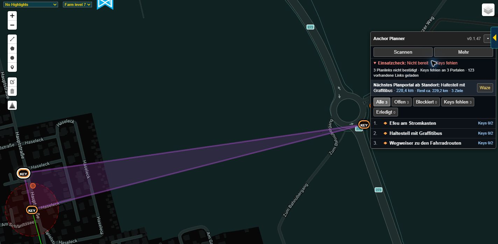
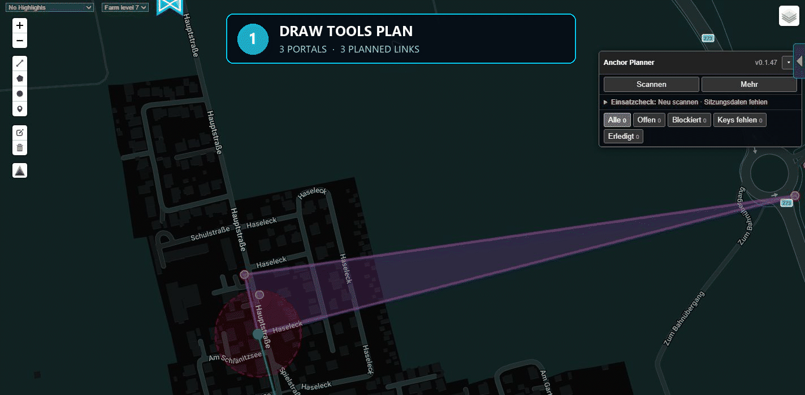

# IITC Anchor Planner

[English](README.md) | [Deutsch](README.de.md)

**Plan fields. Find blockers. Count keys. Build the route.**

Anchor Planner turns Draw Tools and Auto Draw link plans into an actionable IITC workflow: planned portals, required keys, existing links, blockers, work targets, and navigation — in one compact panel for desktop and mobile.

## See it in action

*See the whole plan at a glance: the portals involved, the keys still needed, and the next place to work.*

*Turn a Draw Tools plan into a field-ready checklist in seconds — scan it, check readiness, and open any portal for its exact key requirement.*

## Install

**Latest stable version:**

<https://raw.githubusercontent.com/emgeka/iitc-anchor-planner/main/releases/iitc-anchor-planner.user.js>

Install the `.user.js` file with your userscript manager or the corresponding IITC plugin installation method. If downloading `.user.js` files is inconvenient in your environment, the GitHub release also includes an identical `.txt` build.

Current release: **0.1.53**

<https://github.com/emgeka/iitc-anchor-planner/releases/tag/v0.1.53>

## Why use Anchor Planner?

- **Stop counting keys by hand.** Existing planned links are detected and the remaining key demand is calculated per portal.
- **See blockers directly on the map.** Crossing loaded Intel links, affected plan links, and intersection points are highlighted automatically.
- **Know what to do next.** Open plan portals and selected blocker endpoints become a shared work route with a next target, distance, and estimated remaining route when IITC User Location is available.
- **Turn plans into a checklist.** Track keys, completion state, route order, readiness, and portal status instead of switching between separate notes.
- **Use it in the field.** The compact panel works on desktop and IITC Mobile, can be dragged out of the way, and remembers its position.
- **Share or archive the plan.** Export the plan and blocker details as readable text or JSON.
- **Use your preferred language.** German, English, Spanish, French, Italian, Japanese, Polish, Brazilian Portuguese, Russian, and Simplified Chinese are bundled.

## What it does

Anchor Planner reads Draw Tools geometry — including Auto Draw plans — and combines it with loaded IITC portals, optional Portal Bookmarks, and currently loaded Intel links.

From that data it can:

- resolve planned link endpoints to portals, diagnose unresolved endpoints,
  and load missing names for both plan portals and recognized blocker endpoints;
- detect planned links that already exist;
- calculate remaining key demand;
- detect and highlight crossing blocker links;
- run an optional bounded **Final check** for still-unconfirmed plan links at an IITC zoom that loads every link length, while skipping plan links already recognized as existing;
- prioritize useful blocker endpoints for field work;
- provide a compact readiness check for blockers, missing keys, missing names, unresolved endpoints, and limited link coverage;
- filter portals by open, blocked, missing keys, and completed;
- maintain keys, completion state, notes, and route order;
- dynamically select the next work target using the official IITC User Location plugin;
- estimate straight-line distance and remaining route;
- offer the same **Show details** and **Actions** controls for plan portals and
  blocker endpoints, with Waze, Intel, Google Maps, Apple Maps, and geo
  navigation in the shared actions dialog;
- open IITC's portal detail view for an already loaded plan portal without moving or zooming the map;
- copy or download the plan and detailed blocker information as text or JSON.

The panel can be moved by its header with mouse, touch, or pointer input. Its viewport-constrained position is restored across IITC sessions and corrected after resizing, rotating the display, or expanding and collapsing panel sections. The Anchor Planner layer keeps the visibility selected in IITC across reloads.

## Typical workflow

1. Create a link plan with Draw Tools or Auto Draw.
2. Load the relevant map area and select **Scan**.
3. Check the readiness summary and unresolved endpoints; before field work, run **Final check** for any still-unconfirmed plan links.
4. Review detected blockers and optionally add useful blocker endpoints to the work route.
5. Maintain keys and completed portals while Anchor Planner highlights the next target.
6. Navigate with Waze or another map app and export the plan when needed.

## Requirements and data coverage

- IITC with the Draw Tools plugin enabled is required for scanning.
- Portal Bookmarks improve endpoint resolution but are optional.
- Location-based target selection exclusively uses the official IITC User Location plugin. Location data is neither stored permanently nor exported.
- The normal scan only sees `window.links` currently loaded in IITC. **Final check** temporarily visits at most twelve views along still-unconfirmed plan links at the first IITC zoom without a link-length filter, waits briefly for late link-layer updates, accumulates the loaded links, and restores the original view. Existing recognized plan links are skipped. Newly recognized blocker endpoints enter the automatic name-loading pass. Progress is saved after every view, so a paused check can continue with the unchanged plan, including after reloading IITC. A capped or timed-out run remains explicitly incomplete and is not an all-clear.

## Community Plugins and updates

- Community ID: `anchor-planner@emgeka`
- Required plugin: `draw-tools@breunigs`
- Recommended plugin: `bookmarks@ZasoGD`
- Declared anti-features: `scraper` for automatically loading missing portal names and `export` for user-initiated plan exports
- Catalog icon: published through the userscript metadata from `docs/media/anchor-planner-icon.svg`

`scraper` follows the terminology used by the IITC Community Plugins catalog. Anchor Planner only requests missing names for plan portals and recognized blocker endpoints through IITC's own portal detail functions. Requests run sequentially and automatically after a scan; **Load names** remains available as an explicit retry if IITC could not provide details during that pass. The plugin does not search external websites, permanently collect unrelated portal data, or perform continuous background requests. The user-initiated **Final check** is capped at twelve ordinary IITC map views and does not issue its own Intel tile requests. Therefore, `highLoad` is not declared.

The stable installation URL always points to the latest published release and is intended as the source for the IITC Community Plugins catalog. Development changes under `src/` do not reach installed plugins until they have been tested and published as a release.

## Project status

- Current version: **0.1.53**
- Latest stable release: **0.1.53**
- Development source: `src/iitc-anchor-planner.user.js`
- Published builds: `releases/`
- Userscript ID: `iitc-plugin-anchor-planner`
- IITC plugin ID: `anchor-planner`

## Support and contributions

Bug reports, translation corrections, and focused feature suggestions are welcome in [GitHub Issues](https://github.com/emgeka/iitc-anchor-planner/issues).

If you would like to support development financially, a GitHub Sponsors option is planned and will be linked here once it is publicly available.

## Development

The rules in `AGENTS.md` apply to the entire project. Functional changes are first made only under `src/`. Identical `.user.js` and `.txt` release builds are created only after successful practical tests with desktop IITC and IITC Mobile. The stable files without a version number are then updated to the same content.

Before every handoff, commit, or publication, each change must be reconciled with the complete set of development-relevant files. This includes the source, locales, build process, both README languages, requirements, architecture, known limitations, test scenarios, changelog, and current release files where applicable. All files must be consciously checked and every affected file must be updated in the same change set; explicitly historical releases and changelog sections retain their original state.

Translations are maintained separately under `src/locales/*.json`. Every file contains the same semantic keys and placeholders and provides its native name under `language.name`. `node src/build-locales.mjs` validates all files and bundles them into the single userscript; `node src/build-locales.mjs --check` also verifies that the bundle is current. No language files are loaded from the internet at runtime. English is the required fallback language.
